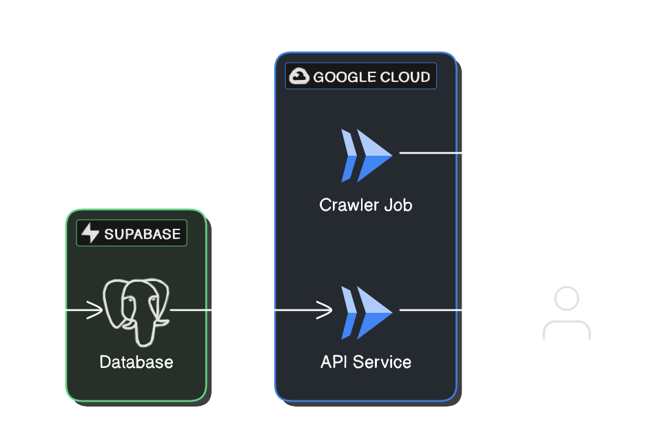

# Douglas Crawler

## Overview

The crawler job is written in Python using HTTPX and BeautifulSoup, and is deployed as a GCP Cloud Run job. The job is
triggered manually, which crawls the default URL, extracts the necessary information, and stores it in a Postgres
database hosted on Supabase.

The web API is powered by FastAPI and is deployed as a GCP Cloud Run service.



All infrastructure is managed using Terraform, and CI/CD is orchestrated via GitHub Actions.

## Directory Structure

- `.github` - Configuration files for GitHub Actions.
- `docs` - Documentation and README files.
- `douglas` - Python code for the crawler and web API.
- `infra` - IaC via Terraform.
- `migrations` - SQL and scripts for database migrations.
- `scripts` - Python scripts for running the crawler locally.
- `tests` - Unit tests for the crawler and web API.

## Usage

### Web API

Explore the Swagger UI at https://douglas-crawler-api-lhebzk57ca-ew.a.run.app/api/docs.

> [!NOTE]
> The web API is configured to autoscale to 0 instances when no traffic is received within a certain
> time window, in order to save costs. If the web API takes a while to load, it is probably undergoing
> a cold start.

Here you will find 3 useful endpoints:

- `/api/crawl` - Crawl a specific product page on [douglas.de](https://www.douglas.de).
- `/api/products` - List all product information stored in the database.
- `/api/products/{ean}` - Retrieve product information stored in the database using the product `ean`.

### CLI

#### Prerequisites

- [Mise](https://mise.jdx.dev)
- [Docker](https://www.docker.com)

#### Setup

1. Install prerequisites.
2. Install additional prerequisites via Mise. This will automatically install Python, Poetry, Task, and Terraform. You
   may not want to use Mise if you already have these tools installed or if you use a different environment manager. At
   minimum, you only need to have Docker.
    ```shell
    mise install
    ```
3. Copy the contents of `.env.example` into a new file `.env` in the same directory, and fill in the necessary
   environment variables.
4. Launch Docker containers
    ```shell
    task

    # Alternatively without Task
    docker compose --project-name douglas-crawler up --detach --build
    ```

#### Running

Run the crawler

```shell
task crawl

# Without Task
docker compose --project-name douglas-crawler exec -t api poetry run python -m scripts.crawl
```

The crawler script has a `-u`/`--url` parameter which defaults to
this [category page](https://www.douglas.de/de/c/gesicht/gesichtsmasken/feuchtigkeitsmasken/120308). To use a different
category page:

```shell
task crawl -- -u https://www.douglas.de/<other-page>
```

A local copy of the web API is available at http://localhost:8000/api/docs.
